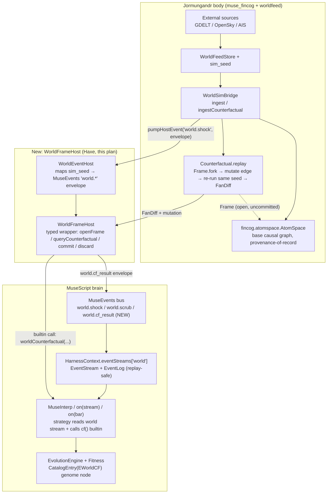

# Jormungandr ↔ MuseScript Integration Plan (v2)

*v1 status carried forward: Desktop/browser JS bridge P0–P3 landed 2026-08-03 (client-only, aux-column snapshot, no AtomSpace). This v2 is written 2026-08-03 to close the two things v1 explicitly deferred or never touched: (a) a **live, in-language event-listener surface** inside MuseScript itself (not just pre-baked aux columns built by Desktop JS before a run starts), and (b) **AtomSpace/CoW-Frame-driven counterfactual queries** callable from a strategy or the evo engine, reusing `fincog.atomspace.Frame` / `fincog.causal.Counterfactual`, which already exist in `muse_fincog` but have never been wired to MuseScript. v1's architecture (`WorldContext`, `scenarioKey`, D1 = Desktop-only execution, no strategy-source upload, Brier-not-P&L) is retained as a hard constraint on everything below.*

*Home: muse-script (brain, this repo). Body: `kalshi-ai-advisor/python/worldfeed` (World-Data feed + `/world/simulate`) + `muse_fincog` (Causal Sim engine, AtomSpace/Frame, Counterfactual) + Desktop `mobile/src/world` (JS bridge, P0–P3 landed). Cross-links: `JORMUNGANDR_MUSESCRIPT_INTEGRATION_PLAN.md` (this file, v1 content folded in below), `JORMUNGANDR_MIROFISH_INSPIRATION.md`, `muse_fincog/docs/WORLD_SIM_BRIDGE.md`, `muse_fincog/docs/SPEC_CAUSAL_SIM.md`, `kalshi-ai-advisor/python/WORLD_DATA_PLATFORM.md` §11.*

---

## Executive summary

MuseScript already has three of the four pieces this integration needs, but they have never been connected to each other for World events: a working pub/sub event bus (`MuseEvents`, `musescript/runtime/MuseEvents.hx`) that *already reserves* a `world.*` event family, a per-strategy live-stream primitive (`EventStream`/`EventLog` on `HarnessContext`) proven in `LiveHarness`/`OrderFlowLive`, and an evolution engine (`EvolutionEngine`/`Fitness`/`Variation`) with a typed hole/catalog system (`HoleDomain`, `CatalogEntry`, `EKind`) built exactly for adding new evolvable primitives. On the Jormungandr side, `muse_fincog` already ships a real copy-on-write reasoning substrate (`fincog.atomspace.Frame.fork`) and a working counterfactual replay (`fincog.causal.Counterfactual.replay` / `WorldSimBridge.ingestCounterfactual`) that mutates one causal edge, re-runs the Propagator on the same DetRng seed, and diffs the fans — this is precisely the CoW-Frame "what if" machinery the task asked for, and it is currently reachable only from a Python/CLI bridge (`sim_bridge.py` → `world-bridge-cli`), never from Haxe or from a MuseScript strategy. The v1 plan (landed) solved a narrower, real problem — "let a hand-run strategy see a pre-computed shock as an aux column" — by building everything in Desktop JS and flattening the world state into `Bar.data` columns before MuseScript ever runs. That is honest and it works, but it is a **one-shot snapshot**, not a **live listener**, and it has zero notion of a counterfactual branch as a first-class, revertible object a strategy or the evolution engine can open, query, and discard. This plan proposes (1) a deterministic, replay-safe `world.*` event class routed through the existing `MuseEvents`/`EventStream` machinery so strategies can react to shocks mid-run instead of only at tape-build time, (2) a thin `WorldFrameHost` seam that exposes `Frame.fork`/`Counterfactual.replay` to MuseScript as a typed builtin + evo-genome node, so "what if this shipping lane closes" becomes an expression a strategy can write and the evolution engine can discover, and (3) explicit genome/palette/fitness wiring for both, so neither construct is a client-JS-only feature the evo engine can never touch — closing the biggest gap in the landed v1 work (which is entirely JS and entirely outside `EvolutionEngine`/`Fitness`/`CatalogEntry`).

---

## Current-state findings (grounded in code actually read)

### MuseScript side (`muse-lab/muse-script`)

| Piece | File:line | What it actually does today |
| --- | --- | --- |
| `MuseEvents` global bus | `musescript/runtime/MuseEvents.hx:29-495` | Static pub/sub (`on`/`once`/`off`/`emit`/`pumpHostEvent`), wildcard subscriptions (`family.*`, `*`), ring-buffer history (cap 64, `dropped` counter), and a **catalog** of typed events with a `deterministic` flag per type. Catalog **already reserves** `world.shock`, `world.scrub`, `world.muse_light`, `world.muse_evolve` (lines 453-465) — all four are stamped `"host", false` (non-deterministic). `setMode("truth")` (line 63) rejects any non-deterministic emit — so **today, `world.*` events cannot fire during a truth/evo/replay run at all**, only in interactive `"live"` mode. This is the single largest concrete gap: the reservation exists, the plumbing to make any `world.*` class deterministic does not. |
| `EventStream` | `musescript/harness/EventStream.hx:8-14` extends `musescript/runtime/StreamIter.hx:6-49` | A per-name buffered `MuseIter` with `push`/`next`/`end`. Backpressure is **drop-oldest**: `if (buffer.length >= maxDepth) buffer.shift()` (StreamIter.hx:22) — silent data loss under storm, no signal to the consumer that anything was dropped. `next()` returns `Await(...)` when empty-and-open, so a strategy iterating a stream cooperatively yields instead of busy-spinning. |
| `EventLog` | `musescript/harness/EventLog.hx:9-23` | Flat `Array<Dynamic>` replayed in order — the deterministic-replay counterpart to the live `EventStream`. `LiveHarness.publish` (below) pushes to both. |
| `HarnessContext.eventStreams` / `.eventLog` | `musescript/harness/HarnessContext.hx:20-21, 83-84` | Declared and constructed on every context, but **grep across the whole `musescript/` tree shows only 4 real call sites**: `LiveHarness.hx` (defines `orderFlow`/`ticks` streams), `OrderFlowLive.hx:48` (an example strategy consuming `orderFlow`), and `MuseInterp.hx:1522` (interp reads a `"ticks"` stream). **Nothing in the codebase today publishes into `eventStreams` from World data** — the hook exists, is proven for order flow, and is simply unused for World. |
| `LiveHarness` | `musescript/harness/LiveHarness.hx:10-113` | The real, working pattern to imitate: `ensureStream(name)` lazily creates an `EventStream`; `publish(streamName, ev)` pushes to the stream **and**, for `"orderFlow"`, to `eventLog` too (line 80) — i.e. it already has the "live stream + deterministic replay log in parallel" shape a World feed needs. `start()`/`stop()`/`pump()` give an explicit session lifecycle so streams close cleanly instead of hanging on `Await` forever. |
| Aux-column path (v1's actual delivery mechanism) | `HarnessContext.pushAuxData` (`HarnessContext.hx:238`), `Bar.data` | `examples/world/shock_gated_trend.ms` reads a naked identifier `world_shock` that resolves through `Bar.data` aux columns built by Desktop JS (`worldTapeBuilder.js`) **before** `MuseRuntime.run` is called. This is real, shipped, and cheap — but it is baked into the bar tape once, not a live subscription; a strategy cannot ask a *new* counterfactual question mid-run, and the evo engine only ever sees `world_shock` as an ordinary numeric series column, never as a typed "world event" or "counterfactual" construct in its genome. |
| Evo genome/palette primitives | `musescript/evo/HoleDomain.hx:8-13`, `CatalogEntry.hx:10-14`, `EKind.hx:4-8`, `EvolutionEngine.hx`, `Fitness.hx` | `HoleDomain` (`DIntRange`/`DRealInterval`/`DFamily`) constrains an author/synthesis hole; `CatalogEntry{slot,kind,path}` is a GP variation site; `EKind` (`EBool`/`EScalar`/`ESeries`) is the three typed families every genome node must belong to. `@param("thresh", 0.08) { min, max, step, tune }` (seen live in `examples/world/shock_gated_trend_evolve.ms:5-7`) is the existing hand-authorable-and-evolvable syntax for scalar holes — the template to extend for World/counterfactual params. `Fitness.evaluate*` runs Expand→compile→WASM/interp per genome; nothing in `Fitness.hx`/`EvolutionEngine.hx` currently references World, AtomSpace, or Counterfactual. |
| IHarness / harness surface | `musescript/harness/IHarness.hx:5-15` | Minimal interface (`runBacktest`, `optimize`, `llmSuggestEncodings`, `distill`, `ensemble`) — no event or world method on the interface; any new World method should live on `HarnessContext` (concrete) the way `eventStreams`/`pushAuxData` already do, not force every `IHarness` implementer to support it. |

### Jormungandr / muse_fincog side (`c:\Users\epiki\Documents\Development\muse_fincog`, sibling repo — **not** under `kalshai/`)

| Piece | File:line | What it actually does today |
| --- | --- | --- |
| `AtomSpace` | `hx/src/fincog/atomspace/AtomSpace.hx:15-199` | In-RAM content-addressed hypergraph (`Map<String,Atom>` + incoming/type/node indexes). `addNode`/`addLink` upsert-merge truth values; `byType`, `incoming`, `assertFact`, `assertIsa` are the query surface. Port of a Python `reasoning_engine/atoms.py` (per the file's own doc comment) — this is the "AtomSpace" referenced throughout the memory index's Reasoning-engine entry. |
| `Frame` (CoW overlay) | `hx/src/fincog/atomspace/Frame.hx:30-307` | **This is the literal CoW-Frame mechanism the task asked about.** `Frame.fork(base)` (line 41) opens a copy-on-write overlay; `touch(atomId)` (line 52) lazily copies a base atom into the overlay on first write so the base is never mutated; `commit()` (line 264) folds the overlay back into its base in dependency order; `discard()` (line 241) throws the whole what-if away; `forkChild()` (line 45) nests a further overlay for branch-of-a-branch exploration (MiroFish-style graph exploration maps directly onto nested `Frame.forkChild()` calls, one per hypothesis depth). `changes()` (line 230) returns `{added, modified, removed}` for provenance/audit. |
| `Counterfactual` | `hx/src/fincog/causal/Counterfactual.hx:24-81` | `replay(space, srcId, dstId, key, value)` (line 39): `Frame.fork(space)` → `GraphCompile.mutateEdgeParam(frame, ...)` on the overlay only → compile both base and overlay into `CausalGraph`s → run `Propagator` on **the same DetRng seed** for both → `FanDiff.compare(baseRun, altRun, ...)`. Returns a `CounterfactualResult` carrying `baseGraph`, `altGraph`, `baseRun`, `altRun`, `diff`, the `frame` itself (still open — caller decides commit/discard), and the exact `mutation` applied. This is a complete, tested (`CounterfactualTest.hx`) request/response shape already. |
| `WorldSimBridge` | `hx/src/fincog/causal/WorldSimBridge.hx:46-430` | The seam between raw World-Data events and the Causal Sim graph. `shockFromEvent`/`shocksFromEvents` parse a `sim_seed` (`{kind, observable, direction, magnitude, region?}`) into a `ShockSpec`, with **explicit, never-silent skip reasons** (`graph_not_loaded`, `sim_seed_absent`, `zero_magnitude`, `observable_unmapped`, `no_shocks` — lines 19-23). `ingest(eventOrBatch)` (line 229) is the one-shot event→shock→`Propagator.run`→optional `Forecast` path already used by `/world/simulate`. **`ingestCounterfactual`** (lines 268-328) is the already-built end-to-end call: event(s) → base run → `Counterfactual.replayGraph` on one mutated edge → `FanDiff` + `altRun` + `mutation` returned alongside the base outcome. This is invoked today only from the Python side (`sim_bridge.py` → `world-bridge-cli`, per recent commits "Pass counterfactual flag through /world/simulate to the bridge CLI", "Prefer world-bridge native-image binary over java -jar for Desktop sim"). |
| `MuseEvents` catalog reservation | (MuseScript side, cited above) | Confirms the two sides already agree on a *name* (`world.shock`) for the seam; they simply don't share a wire format for it yet beyond the JS-only `WorldContext`/`sim_seed` typedefs. |

**The gap, stated precisely:** `fincog.atomspace.Frame` / `fincog.causal.Counterfactual` are Haxe classes that compile on the same toolchain family as MuseScript, live in a sibling repo with no build dependency in either direction, and have **never been imported, referenced, or exposed** from anywhere in `muse-lab/muse-script` (confirmed: `grep -rl fincog` in muse-script matches only markdown docs and one PanelRunner.hx comment reference, no `.hx` import). Desktop's `worldMuseBridge.js` and the Python `/world/simulate` route both talk to `WorldSimBridge`/`Counterfactual` already — but only to *paint the map*, never to hand a live counterfactual handle to a running or evolving MuseScript strategy.

---

## Proposed architecture



### API contract 1 — deterministic `world.*` event envelope (extends v1's `WorldContext`)

```ts
// Carried on MuseEvents envelopes; also the EventLog replay record shape.
type WorldEventEnvelope = {
  type: "world.shock" | "world.scrub" | "world.cf_result";
  schemaVersion: "musescript.events/1";
  class: "det" | "host";        // NEW: world.shock/scrub become "det" when sourced
                                  // from a recorded WorldContext tape (see Risk R1)
  deterministic: boolean;
  scenarioKey: string;           // v1's scenarioKey, unchanged
  eventIds: string[];
  ts: number;                    // sim-time (tDays) for det replay, wall time for host/live
  // world.shock payload
  mag?: number; dir?: number; region?: string; observable?: string;
  // world.cf_result payload (NEW, see contract 2)
  cfHandle?: string;
  diffSummary?: { maxDelta: number; exceedFrac: number; alteredNodes: string[] };
};
```

`class: "det"` is only legal when the envelope was produced by replaying a **recorded** `EventLog` tape (see D5 below) — never from a live/interactive World feed. This is what unlocks `world.*` events inside `MuseEvents.setMode("truth")` runs (today categorically blocked, per the finding above) without weakening the truth-mode guarantee: determinism comes from the tape being fixed and shipped with the run, not from the live feed being trustworthy.

### API contract 2 — `WorldFrameHost` (new Haxe module, `musescript/harness/WorldFrameHost.hx` or `musescript/builtins/WorldBuiltins.hx`)

A thin, typed wrapper — **not a reimplementation** — over `fincog.atomspace.Frame` / `fincog.causal.Counterfactual` / `fincog.causal.WorldSimBridge`:

```haxe
class WorldFrameHost {
  // Opens (or reuses, keyed by scenarioKey) a Frame.fork over the loaded
  // WorldSimBridge.graph's materialized AtomSpace. Returns a handle string,
  // never the Frame object itself, across the MuseScript/JS boundary.
  public function openFrame(scenarioKey:String):String;

  // Wraps Counterfactual.replay: mutate one edge param on the open frame,
  // re-run Propagator at the SAME seed as the base run, return FanDiff summary.
  // Strategy-facing signature stays narrow: node ids, not raw AtomSpace atoms.
  public function queryCounterfactual(frameHandle:String, srcNodeId:String,
      dstNodeId:String, key:String, value:Float):WorldCfResult;

  // Frame.commit() / Frame.discard() — explicit, so a strategy (or the evo
  // engine, between genomes) always leaves no dangling overlay.
  public function commitFrame(frameHandle:String):Void;
  public function discardFrame(frameHandle:String):Void;
}

typedef WorldCfResult = {
  ok:Bool, reason:Null<String>,     // "counterfactual_unavailable" etc., mirrors WorldSimBridge skip reasons
  maxDelta:Float, exceedFrac:Float, alteredNodes:Array<String>
};
```

**Strategy-facing builtin** (MuseScript surface, hand-authorable):

```
cf_diff("shipping:SUEZ", "equity:GLOBAL", "latB", 24.0)   // → WorldCfResult-shaped record
```

Returns a plain record so `if (cf_diff(...).exceedFrac > 0.3) { ... }` reads naturally and — critically — is the **same call shape** the evo engine's new `EKind.EWorldCf` catalog node emits, so hand-written and auto-discovered code are literally the same AST shape (see evo-engine implications below).

### No-lookahead / causality guarantee

Two independent guarantees, matching the two data paths:

1. **Aux-column path (v1, unchanged):** `world_shock` etc. are joined as-of at tape-build time; v1's own selftest already asserts "shuffle future fan → unchanged past bars." This plan does not touch that path.
2. **Live/event path (new):** `EventStream.next()`'s `Await` semantics mean a strategy only observes a `world.*` event once `MuseEvents.emit` has fired it for a bar index the strategy has already reached — but nothing today stamps a `barIndex`/`asOf` field enforcing that a future-dated event can't be pumped early by a buggy host. **This plan adds that stamp as a required field on `WorldEventEnvelope` and a harness-side assertion** (`HarnessContext` rejects/queues an event whose `asOf > currentBar.time`) — this is new work, not something already enforced, and is called out explicitly in Risks.
3. **Counterfactual path (new):** `queryCounterfactual` never touches the *base* AtomSpace (proven by `Frame`'s CoW design itself — `touch()` always copies into the overlay first) and never mutates the strategy's own bar tape; it only returns a diff summary. A strategy cannot use it to peek at a shock that resolves later in the same tape unless the World feed already exposed that shock as a `world.shock` event at or before the current bar — the counterfactual answers "what would happen if magnitude/latency differed", not "what will happen next."

---

## Phased plan

### P0 — Thin end-to-end slice: prove the seam both directions

**Goal:** one MuseScript strategy subscribes to a live `world.shock` stream via the *existing* `EventStream` machinery (not aux columns), and one MuseScript builtin calls into `WorldFrameHost.queryCounterfactual` and gets back a real `FanDiff`-derived record. No evo engine yet.

**Deliverables:**
- `musescript/harness/WorldFrameHost.hx` (new) — thin wrapper as specified above. Depends on `muse_fincog`'s `fincog.atomspace.Frame` / `fincog.causal.Counterfactual` / `fincog.causal.WorldSimBridge`; **first decision needed is how muse-script pulls in `muse_fincog` Haxe sources** (haxelib path dependency vs. vendored copy vs. keep the CLI-shell approach and make `WorldFrameHost` a thin JSON-RPC client to `WorldSimBridgeCli` — see Open Decision D6, this plan recommends starting with the CLI-shell option to avoid a build-graph merge).
- `HarnessContext.eventStreams.set("world", new EventStream("world"))` wired by whichever host drives a run (`LiveHarness`-style, not the plain backtest `HarnessContext`) — mirrors the existing `orderFlow`/`ticks` pattern exactly.
- A `worldEventHost` bridge function (JS side, extends `worldMuseBridge.js` from v1) that takes a `WorldSimBridge.ingest()` outcome and calls `MuseEvents.pumpHostEvent("world.shock", envelope)` **and** pushes the same envelope onto `HarnessContext.eventStreams.get("world")` — proves both the global-bus path and the per-strategy-stream path from one source event.
- One example strategy, `examples/world/shock_listener.ms`, using `@on(stream("world"))` (or the existing stream-consumption idiom seen in `OrderFlowLive.hx`) to react to a live shock mid-run, plus one line calling `cf_diff(...)`.
- Builtin registration: `cf_diff` added to `musescript/builtins/` dispatch, delegating to `WorldFrameHost.queryCounterfactual`.

**Verification / acceptance:**
- Deterministic offline test: replay a fixed `EventLog` of 3 `world.shock` envelopes into a strategy; assert the strategy's signal flips match hand-computed expectations (same style as existing `EventLog`-replay tests).
- `cf_diff(...)` against `WorldSimBridge.toyWorldRiskGraph()` (already a public static fixture, `WorldSimBridge.hx:363`) returns a non-null `WorldCfResult` with `ok:true` and the exceedance direction matches the sign of the mutated edge's `latB` stretch — reuses `CounterfactualTest.hx`'s existing fixtures/expectations as the oracle.
- Honesty check: disconnect the bridge (no graph loaded) → `cf_diff` returns `{ok:false, reason:"counterfactual_unavailable"}`, never a fabricated diff — mirrors `WorldSimBridge.ingestCounterfactual`'s existing `cfReason` skip path.

### P1 — Determinism: make `world.*` events legal inside `truth` mode

**Goal:** close the gap found in `MuseEvents.hx` — `world.shock`/`world.scrub` are currently hard-coded `"host", false` and therefore **always** blocked once `MuseEvents.setMode("truth")` is active, which means World events can never appear in a Truth Report or a determinism-proof run today.

**Deliverables:**
- Add a `WorldEventEnvelope.class` override path: when an envelope is built from a **recorded** `EventLog` tape (a `WorldContext` stamped `recorded: true`, i.e. list of `{asOf, type, payload}` shipped alongside the run — not the live feed), `pumpHostEvent` stamps `class:"det", deterministic:true` instead of the catalog default. Requires a small `MuseEvents.catalogEntries()` change (currently a flat static list, `MuseEvents.hx:380-479`) to accept a per-call override rather than only the catalog default — a narrow, backward-compatible change (`normalize()` already checks `Reflect.hasField(out,"class")` before falling back to catalog, `MuseEvents.hx:327`, so this may already work with zero engine change — **verify in P1, don't assume**).
- `proveDeterminism`-style test: same recorded World tape + seed → bit-identical equity/fill digest across two runs, same guarantee v1 already ships for `scenarioKey` + seed (carry the existing selftest pattern over to the event path).
- Update `WorldEventEnvelope.asOf` no-lookahead assertion in `HarnessContext` (called out above) — ship it here since P1 is the first phase where a *recorded* deterministic tape exists to test it against.

**Verification:** `proveDeterminism` on a fixture strategy + fixture World tape passes; a mutated (shuffled-future) tape fails the `asOf` assertion loudly instead of silently changing past behavior — the same shape as v1's existing "shuffle future fan" selftest, extended from aux-columns to events.

### P2 — Evo-engine wiring: counterfactual queries and world-event gating become genome material

**Goal:** the evolution engine can *discover* strategies that call `cf_diff(...)` or gate on a `world.shock` stream, not just run hand-written ones.

**Deliverables:**
- `EKind.EWorldCf` — new genome node kind (extends `EKind.hx:4-8`'s `EBool|EScalar|ESeries` triad). Emits a scalar (`exceedFrac` or `maxDelta`, author's choice of projection) so it composes with existing `EScalar` combinators without a new type-system axis.
- `CatalogEntry` sites: a new catalog family for `cf_diff(srcId, dstId, key, value)` call sites, where `srcId`/`dstId` are drawn from `HoleDomain.DFamily(names)` (already exists, `HoleDomain.hx:11-12`, built exactly for "restrict draws to a named family" — reuse verbatim for "restrict to nodes present in the loaded `WorldSimBridge.graph`") and `value` is `HoleDomain.DRealInterval(lo,hi)` (also already exists).
- `Fitness.hx` hook: when a genome contains an `EWorldCf` node, `Fitness.evaluate*` must supply a `WorldFrameHost` handle bound to the fitness-run's `scenarioKey`/seed — mirrors how `panelFeed`/`PSHost` are attached today (`Fitness.hx`'s existing doc comment on panel fitness, "when `panelFeed` is attached via `configurePanel`", is the precedent to copy). Genomes without `EWorldCf` are unaffected, same non-invasive pattern the panel-fitness feature already uses.
- Multi-scenario holdout (reuses v1 P2's `evolveUnderWorld` concept, but now at the genome level, not the Desktop-JS level): a champion whose `EWorldCf` node only pays off on the training `scenarioKey` and fails an embargoed one is rejected — same holdout-gate philosophy v1 already shipped for Desktop `evolveUnderWorld`, now enforceable because the evo engine itself can see the World construct instead of it being invisible JS glue.
- `Frame` lifecycle inside fitness: **every genome evaluation must `discardFrame` its `WorldFrameHost` handle** (never `commit`) — fitness evaluation is read-only exploration by construction; committing a counterfactual into the base AtomSpace from inside a fitness loop would be a determinism/provenance violation. Enforce this in `Fitness.hx`'s cleanup path, not by convention.

**Verification:** a small CorpusEvoRun-style seeded search over `examples/world/shock_gated_trend_evolve.ms`-shaped genomes with `EWorldCf` enabled discovers *some* champion using `cf_diff`; disabling the `EWorldCf` catalog entry (flag-gated) reproduces the exact v1 baseline (no regression when the feature is off) — the standard "flag off ⇒ prior behavior" bar this codebase already holds itself to (see `panelFillNextOpen` default-false precedent, `HarnessContext.hx:31-32`).

### P3 — MiroFish-inspired branch exploration: nested frames as a queryable tree

**Goal:** surface `Frame.forkChild()`'s nesting (branch-of-a-branch) as an explorable structure, echoing v1's already-adopted MiroFish "abstract causal graph dock" idea (`JORMUNGANDR_MIROFISH_INSPIRATION.md` pattern **C**) but grounded in the *real* AtomSpace/Frame tree instead of a decorative D3 force graph.

**Deliverables:**
- `WorldFrameHost.forkChild(frameHandle, ...)` exposing `Frame.forkChild()` (`Frame.hx:45`) — lets a strategy or a Light-Muse "interview" tool (v1's adopted pattern **E**, tool-bound only) open "what if X, and *also* what if Y given X" without ever touching the base graph.
- `changes()`-backed provenance payload (`Frame.hx:230`, already returns `{added, modified, removed}`) surfaced as the audit trail for any committed frame — satisfies the Constitution's calibration-not-vanity provenance requirement with an artifact that already exists in the engine rather than a new invented log format.
- Desktop overlay: a frame-tree panel (siblings of v1's already-shipped Map|Split|Muse layout triad) showing open/discarded/committed frames per `scenarioKey` — pure UI, no new engine surface beyond what P0–P2 exposed.

**Verification:** nested `forkChild` three levels deep, `commit()` at the leaf, confirm `changes()` at each level correctly attributes adds/modifies only to that level (unit test against `fincog`'s existing `Frame` test suite pattern, extended one level of nesting beyond what `CounterfactualTest.hx` currently exercises — verify current depth first, don't assume it's already covered).

---

## Risks & open questions

- **R1 (causality/lookahead, new work, not yet built):** the `asOf` no-lookahead assertion on live `world.*` events (P1) does not exist today — `EventStream`/`EventLog` have no time-stamp enforcement at all currently; this plan requires adding it, and until it lands, a buggy host *could* pump a future event early with no engine-level guard (only v1's aux-column path has a proven no-lookahead selftest).
- **R2 (backpressure is silent data loss today):** `StreamIter.push` drop-oldest (`StreamIter.hx:22`) with no dropped-count exposed to the strategy (contrast with `MuseEvents`'s bus-level `droppedCount()`, which *does* exist, `MuseEvents.hx:89`). A storm of `world.shock` events could silently starve a strategy's view with no visible symptom. Recommend surfacing `EventStream.droppedSince(...)` before P0 ships to Desktop, or explicitly document the risk if deferred.
- **R3 (build-graph coupling, open decision, not resolved by this plan):** `muse_fincog` is a **sibling repo with no existing build dependency** to `muse-script` in either direction. `WorldFrameHost` needs `Frame`/`Counterfactual`/`WorldSimBridge` at Haxe compile time (for a native/JVM evo path) or can shell out to the existing `WorldSimBridgeCli` (JSON in/out, no build coupling, but per-call process-spawn cost and loses the in-process `Frame` handle across calls unless the CLI itself grows session state). **This plan explicitly does not choose** — see D6 below — because the tradeoff (compile coupling vs. runtime cost vs. session-state complexity) is a real architectural fork that should be decided once P0's actual latency is measured, not guessed.
- **R4 (performance):** `Counterfactual.replay` does two full `Propagator.run` calls (`nRuns` Monte Carlo paths each, default 400 per `Counterfactual.hx:26`) per `cf_diff(...)` call. Fine for one interactive Light-Muse query; likely **too slow inside a per-genome fitness loop** evaluating thousands of genomes (P2) unless `nRuns` is cut sharply for evo-time queries or results are memoized per `(scenarioKey, srcId, dstId, key, value)` tuple — `EvoCache.hx` already exists in `musescript/evo/graal/` for exactly this kind of memoization pattern; reuse it rather than inventing a second cache.
- **R5 (provenance versioning):** `WorldEventEnvelope.schemaVersion` and v1's `WorldContext.schemaVersion` are two different version fields on two related-but-separate JSON shapes today (JS `WorldContext` vs. this plan's Haxe-facing event envelope). Left unresolved here — needs a decision on whether they're the same document evolving, or deliberately separate (event log vs. context snapshot).
- **Unresolved / inferred, flagged explicitly:** this plan infers that `MuseEvents.normalize()`'s existing `Reflect.hasField(out,"class")` early-out (line 327) is sufficient to let a caller override the catalog's hard-coded `"host", false` for `world.shock` without an engine code change — **this is an inference from reading the function, not a verified test result**; P1's first task must confirm it before building anything on top.
- **Non-goal carried over from v1, restated:** no strategy source ever uploads to `/world/*`; `WorldFrameHost` in the CLI-shell configuration (R3) must ship only `{srcId,dstId,key,value,scenarioKey}` over the wire, never MuseScript source, matching v1's D1 Article III.6 constraint.

---

## Explicit evo-engine implications

| New construct | Genome representation | Palette / catalog entry | Fitness interaction |
| --- | --- | --- | --- |
| `world.*` event gate (e.g. `if (!na(world_shock) && ...)`) | **No change needed** — this is v1's shipped aux-column path; already an ordinary `ESeries`/`EScalar` node reading a named column. Evo already discovers thresholds on it via existing `HoleDomain.DRealInterval` (proven in `shock_gated_trend_evolve.ms`). | Existing `CatalogEntry` machinery, no new `EKind`. | No change — already fitness-neutral, already flag-off-safe. |
| Live `world.*` stream subscription (P0/P1, new) | New `EKind` not required if modeled as "another aux-style scalar sampled per-bar from the current stream head" — recommend **not** giving evo direct stream-iteration control (no `while(stream.next())` in genome space; too easy to desync from bar-synced fitness replay). Expose only a derived per-bar scalar (`world_event_active`, `world_event_mag`) the same way `world_shock` already is. | Reuse existing aux-column catalog path — deliberately **not** a new palette family, to keep evo's view of "world" uniform whether it came from v1's snapshot join or P1's live replay. | None beyond what already exists for aux columns; `Fitness` doesn't need to know the column's provenance. |
| `cf_diff(srcId, dstId, key, value)` counterfactual query (P2, genuinely new) | **New `EKind.EWorldCf`** node, scalar-producing (project `WorldCfResult` down to `exceedFrac` or `maxDelta` — author picks via a second small enum param, itself an `HoleDomain.DFamily(["exceedFrac","maxDelta"])` hole). | New `CatalogEntry` family: `srcId`/`dstId` holes typed `HoleDomain.DFamily(graph node ids)` (list sourced live from the attached `WorldSimBridge.graph`, so evo can never propose an unmapped node — mirrors `WorldSimBridge.resolveObservable`'s own honesty guarantee); `value` hole typed `HoleDomain.DRealInterval(lo,hi)` bound to the edge's sane physical range (e.g. `latB` days, not unconstrained floats). | **New, required:** `Fitness.evaluate*` must attach a `WorldFrameHost` bound to the run's `scenarioKey`/seed before evaluating any genome containing `EWorldCf` (mirrors the existing `panelFeed` attach-only-if-present precedent) and **must `discardFrame`** after every evaluation — fitness is read-only by construction, never allowed to `commit`. Multi-scenario holdout (P2) is required for any genome using `EWorldCf`: a champion that only wins on the training `scenarioKey`'s counterfactual answer fails the embargo gate, same shape as v1's Desktop-level `evolveUnderWorld` holdout, now enforced inside `EvolutionEngine`/`Fitness` instead of only in Desktop JS. |
| Nested/branch counterfactuals (`forkChild`, P3) | Not proposed for genome space at all — deliberately kept **hand-author-only** (Light-Muse "interview" tool, P3). Nesting depth as a mutation target would make genome evaluation cost unbounded and unpredictable; this is the one construct in this plan where the "co-design for both hand-authoring and auto-discovery" goal is explicitly **not** pursued, and that choice is called out rather than silently dropped. | None. | None. |

---

## v1 content retained (landed, unchanged by this plan)

Everything below is copied forward from the original plan because it is real, shipped (2026-08-03), and remains the correct architecture for the parts of the problem it solves (Desktop/browser-only execution, aux-column tape building, scenario-keyed leaderboard/ledger, MiroFish UI patterns). This plan (v2) **adds** the live-event and AtomSpace-counterfactual layers above; it does not replace any of the below.

- `WorldContext` envelope (schema v1), `WorldTapeBuilder` (timestep vs. calendar-splice alignment, D2 resolved as calendar-splice default), `worldMuseBridge.js` (`runUnderWorld`/`evolveUnderWorld`/`forecastFieldsUnderWorld`), `POST /world/muse/context` (deferred, still deferred by this plan too — client-only tape building remains sufficient through P1 of this plan as well).
- D1 resolved: **Desktop/browser-only Muse execution.** This plan's P0–P2 do not change D1 — `WorldFrameHost`'s CLI-shell option (R3/D6) keeps strategy execution client-side; only the counterfactual *query* (small JSON parameters, no source) may cross to a server-side `WorldSimBridgeCli` process, same privacy posture as v1's `/world/simulate` already has for the base (non-counterfactual) sim.
- Honest Ledger / Leaderboard `scenarioKey` scoping, Brier-not-P&L constitution constraints, `worldRegimePacks.js`, `worldLabSession.js` digest parity, Map|Split|Muse layout triad — all unchanged, all still the product surface this plan's engine-level work will eventually feed.
- MiroFish adoption order (A–M, first and second pass) — unchanged; this plan's P3 is the concrete engine-level home for MiroFish pattern **C** (abstract causal graph dock) that v1 flagged as "complements map" without specifying what backs it — this plan specifies it: the real `Frame`/`Counterfactual` tree, not a second decorative viz.

### New open decisions this plan adds (D5, D6 — D1–D4 from v1 stand as resolved/unchanged above)

**D5 — What makes a `world.*` event "recorded" (deterministic) vs "live" (host-class)?**

| Option | Pros | Cons |
| --- | --- | --- |
| **A. Any `EventLog`-sourced replay is det; any `MuseEvents.emit` from a live feed is host** | Matches existing `EventLog`/`EventStream` split exactly; zero new concept | Two code paths for "the same event type" depending on origin — must not let live events silently masquerade as det |
| **B. New `recorded:true` flag on `WorldContext`, checked at pump time** | Explicit, auditable, one flag to grep for | Another field to keep in sync with `scenarioKey`/schemaVersion |

Recommendation: **A**, using the machinery that already exists (`EventLog` replay vs. `EventStream` live push), rather than inventing a new flag — but this needs a P1 spike to confirm `MuseEvents.normalize()`'s class-override actually behaves as inferred (see Risk, unresolved item above).

**D6 — How does `WorldFrameHost` reach `fincog.atomspace.Frame` / `Counterfactual`?**

| Option | Pros | Cons |
| --- | --- | --- |
| **A. CLI-shell** (extend `WorldSimBridgeCli`, JSON request/response, no build coupling) | Zero build-graph merge; matches v1's existing `sim_bridge.py → world-bridge-cli` pattern exactly; keeps `muse_fincog` and `muse-script` fully independent repos | Per-call process/JVM-warmup cost (R4 compounds this for P2's fitness-loop case — needs a long-lived CLI session or batch-query mode, not one process per `cf_diff` call) |
| **B. Haxelib path dependency** (muse-script's `.hxml` gains a `-cp` to `muse_fincog/hx/src`) | In-process, fast, natural for P2's per-genome fitness loop | Couples two previously-independent repos' build graphs and release cadence; `fincog` package would need to be haxelib-published or path-pinned |
| **C. Vendor a frozen copy of `atomspace`/`causal` into `musescript/vendor/fincog/`** | Fully decoupled at runtime, no cross-repo build step | Drift risk (two copies of `Frame`/`Counterfactual` diverging silently) — actively discouraged by this codebase's own conventions elsewhere (v1 explicitly refuses to vendor MiroFish for the same drift reason) |

Recommendation: **A for P0** (matches existing precedent, unblocks the thin slice fastest), **revisit B only if P2's fitness-loop call volume makes CLI round-trip cost prohibitive** (measure first, per R3/R4) — mirrors this plan's own D1 pattern of "ship the safe option, revisit under load," which is also how v1 resolved its D1.
